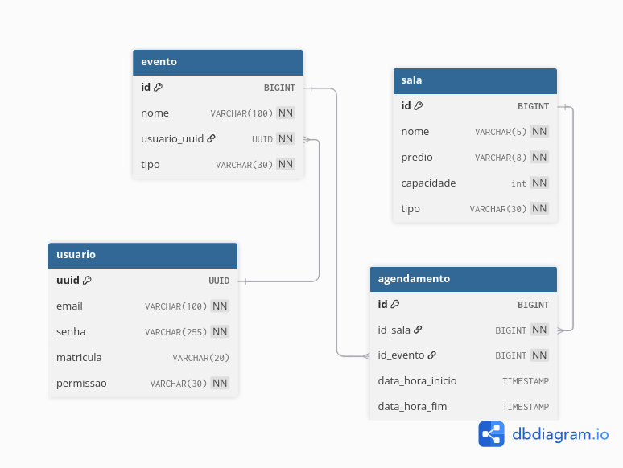
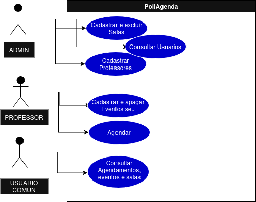

# Documentação do Banco de Dados

## Visão Geral

O sistema utiliza PostgreSQL como banco de dados principal, com migrações gerenciadas pelo Flyway. O banco é projetado para suportar agendamentos de salas universitárias com controle de conflitos de horário e validações de integridade.

## Estrutura do Banco

### Diagrama ER

### Casos de uso

## Migrações

### V1__Create_tables.sql

Criação inicial das tabelas com:
- Tabelas principais (admin, professor, evento, sala, agendamento)
- Constraints de validação

### Criptografia

- Senhas devem ser criptografadas usando BCrypt
- Dados sensíveis devem ser mascarados em logs
